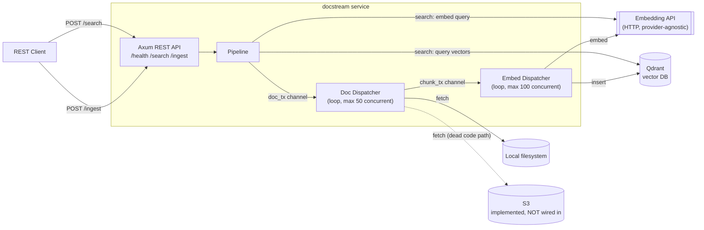
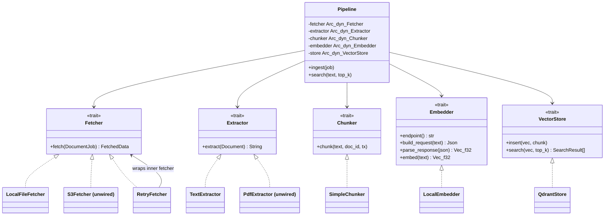
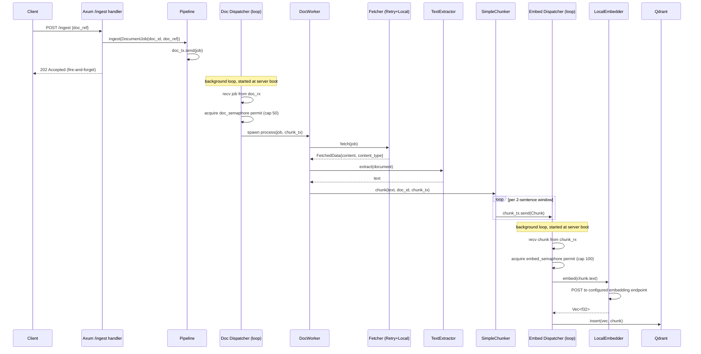
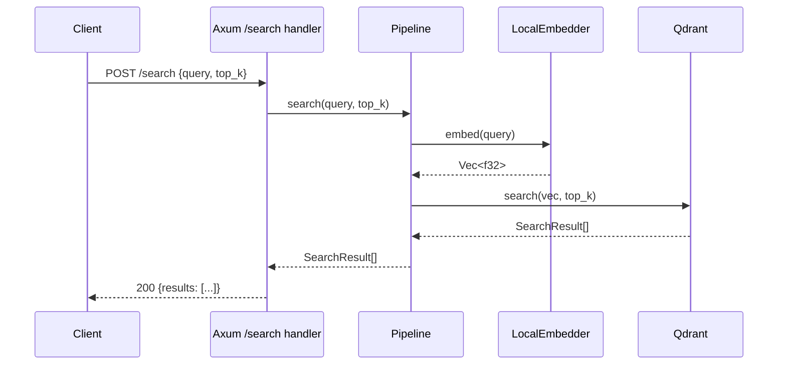

# docstream — Architecture

## What this is

`docstream` is the ingestion + retrieval half of a RAG (retrieval-augmented generation) system. It takes documents (currently: local text files), turns them into overlapping text chunks, embeds each chunk into a vector via an external embedding API, and stores the vectors in Qdrant. A search endpoint embeds a query and returns the closest matching chunks. It's a small REST service (axum) fronting an async, trait-based ETL pipeline.

## System overview



## Module / trait structure

Every pipeline stage is a trait, injected as `Arc<dyn Trait>` into `Pipeline` — no framework, manual DI via `PipelineBuilder`.



**Actually wired today** (`PipelineBuilder::build()` in `pipeline.rs`): `LocalFileFetcher` wrapped in `RetryFetcher` (5 retries, 750ms base exponential backoff) → `TextExtractor` (raw UTF-8 decode) → `SimpleChunker` (naive 2-sentence sliding window, step 2, no overlap, no size cap) → `LocalEmbedder` (generic HTTP embedding client, provider configured via env) → `QdrantStore`.

`S3Fetcher` and `PdfExtractor` are fully implemented but never constructed anywhere outside their own files — ingesting a PDF or an S3-hosted document does not currently work, regardless of `doc_ref` format.

## Ingest flow



There is no job-status endpoint — once queued, the client has no way to check whether ingestion succeeded, failed, or is still in progress; outcomes are only visible in server logs.

## Search flow



## REST API reference

### `GET /health`
Liveness check. No request body.

| | |
|---|---|
| Response `200` | body: `OK` (plain text) |

### `POST /search`
Embeds `query`, searches Qdrant, returns the closest chunks.

**Request**
```json
{
  "query": "what did the report say about churn?",
  "top_k": 5
}
```

**Response `200`**
```json
{
  "results": [
    {
      "chunk_id": "b3f1c2d4-...-uuid",
      "score": 0.83,
      "text": "matched chunk text",
      "document_id": "a1e2c3d4-...-uuid"
    }
  ]
}
```

**Response `500`** (embed or Qdrant failure — logged server-side only, no error detail returned)
```json
{ "results": [] }
```

### `POST /ingest`
Queues a document for background processing. Returns immediately; does not wait for the pipeline to finish.

**Request**
```json
{
  "doc_ref": "data/sample.txt"
}
```
`doc_ref` is a local filesystem path today — the only wired fetcher is `LocalFileFetcher`. `.pdf`-suffixed paths are tagged `application/pdf` by the fetcher but there's no extractor dispatch by content type, so PDFs aren't actually processable end-to-end yet (`PdfExtractor` exists but isn't wired in).

| | |
|---|---|
| Response `202` | Accepted, empty body. Document is queued; a `doc_id` (server-generated `Uuid`) is assigned but **not returned to the client** — there's currently no way to look it up. |
| Response `500` | empty body (error logged server-side only) |

## Configuration

Loaded once at startup via `AppConfig::from_env()` (`src/config/loader.rs`); `.env` is read if present (`dotenvy`), all vars below are otherwise required except where noted.

| Var | Purpose |
|---|---|
| `EMBEDDER_PROVIDER` | Free-text label, currently unused by `LocalEmbedder` (vestigial) |
| `EMBEDDER_ENDPOINT` | HTTP endpoint the embedder POSTs `{input, model}` to |
| `EMBEDDER_MODEL` | Model name sent in the embed request body |
| `EMBEDDER_API_KEY` | *Optional* — not currently sent as an auth header anywhere in `LocalEmbedder` |
| `QDRANT_URL` | Qdrant server/cloud endpoint |
| `QDRANT_API_KEY` | Qdrant auth |
| `QDRANT_COLLECTION_NAME` | Collection to create/use (auto-created on startup if missing) |
| `QDRANT_VECTOR_SIZE` | Must match the embedder's output dimensionality |

## Known gaps (see `REVIEW.md` / `REFACTOR.md` for full detail)

- S3 ingestion and PDF extraction are implemented but not wired into the running pipeline.
- No job-status endpoint; ingestion is fully fire-and-forget.
- Zero automated tests.
- A panic in either background dispatcher loop currently takes down the entire server (`main.rs`).
- Chunking is a fixed, unconfigurable 2-sentence window with no size cap or overlap.
